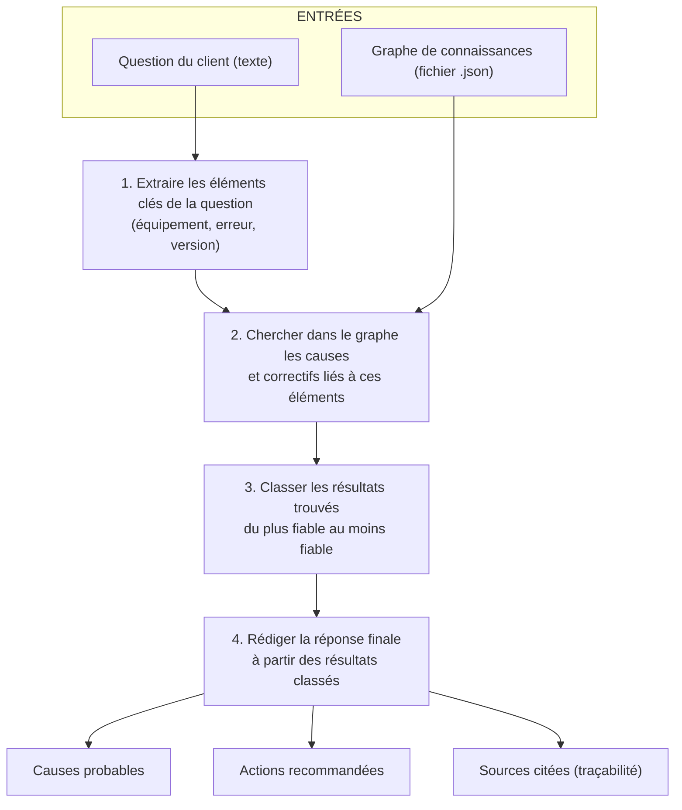

# Explainable Enterprise GraphRAG Assistant

Assistant de support technique basé sur **GraphRAG** (Graph-based Retrieval-Augmented
Generation) : au lieu de faire du RAG classique sur des chunks de texte non structurés,
le système récupère l'information dans un **graphe de connaissances** (équipements,
versions de firmware, erreurs, causes, procédures, documents) et construit une réponse
**traçable**, où chaque affirmation est justifiée par un chemin explicite dans le graphe.

## Exemple

> **Question du client :** *« Pourquoi mon équipement X100 affiche Error 542 après la
> mise à jour 4.2 ? »*

```
=== Réponse ===
**Causes probables :**
- Le certificat racine installé sur le serveur de supervision est antérieur au
  nouveau schéma de validation introduit en 4.2, ce qui provoque le rejet du
  handshake TLS. (confiance ≈ 85%)
- Une dérive d'horloge de plus de 5 minutes entre l'équipement et le serveur
  peut aussi invalider le certificat et produire l'erreur 542. (confiance ≈ 40%)

**Actions recommandées :**
- Déployer le nouveau certificat racine v3 sur le serveur de supervision via
  le portail d'administration, puis redémarrer le service de supervision.

**Sources documentaires :**
- Article KB-542 : ...
- Notes de version 4.2 : ...

=== Traçabilité (explicabilité) ===
[1] Error 542 --[HAS_LIKELY_CAUSE]--> Certificat racine obsolète
[2] Error 542 --[HAS_LIKELY_CAUSE]--> Certificat racine obsolète → ... --[RESOLVED_BY]--> Mettre à jour le certificat racine
[3] Error 542 --[DOCUMENTED_IN]--> Article KB-542
...

Confiance globale estimée : 85%
```

Chaque cause/action n'est pas "inventée" par un LLM : elle correspond à un **chemin
réel dans le graphe**, affiché dans la section traçabilité. C'est ce qui rend le
système *explicable* et auditable — un pré-requis important en environnement
industriel/entreprise où une réponse de support doit pouvoir être justifiée.

## Architecture

Le système suit un pipeline simple : **entrées** (distinctes selon leur nature)
→ **traitement séquentiel** (chaque étape consomme la sortie de la précédente)
→ **sorties** (trois éléments distincts).



Un diagramme éditable équivalent est disponible dans `docs/architecture.drawio`
(à ouvrir sur [app.diagrams.net](https://app.diagrams.net) ou dans l'extension
VS Code draw.io) : chaque entrée y a son propre pictogramme (bulle de texte
pour la question, icône fichier pour le graphe), les 4 étapes de traitement
sont enchaînées dans l'ordre avec leur méthode et leur technologie, et les
3 sorties sont représentées séparément.


### Pistes pour enrichir le NLP dans une suite de ce travail

L'extraction d'entités actuelle (étape 1) et l'ancrage (étape 2) sont les
points les plus simplistes du pipeline et les premiers candidats à une
amélioration par NLP :
- Un modèle de **NER** (ex. spaCy `fr_core_news_lg`, ou un modèle Transformer
  affiné pour le domaine technique) à la place des regex, pour reconnaître les
  variantes de formulation (fautes de frappe, synonymes de modèle d'équipement).
- Des **embeddings de phrases** (ex. `sentence-transformers`) pour l'ancrage,
  en remplacement de la correspondance lexicale par tokens, afin de gérer les
  reformulations sémantiquement proches mais lexicalement différentes.

Ces pistes ne sont **pas implémentées** dans ce prototype ; elles sont
mentionnées ici pour situer précisément le périmètre actuel et les
prolongements possibles.

## Évaluation quantitative

Pour objectiver l'apport du GraphRAG plutôt que de l'affirmer sans preuve,
`eval/run_evaluation.py` compare notre pipeline à une **baseline RAG
vectorielle classique** (`eval/baseline_tfidf.py`) : celle-ci traite chaque
nœud du graphe comme un chunk de texte indépendant et récupère par similarité
cosinus TF-IDF, **sans utiliser les relations du graphe** (pas de raisonnement
multi-sauts). Pour rester une comparaison honnête, la baseline reçoit un
avantage non trivial : elle connaît le type de chaque chunk (Cause /
FixProcedure), ce qu'un RAG "à plat" sur documents non structurés n'aurait
même pas.

**Protocole** : 10 questions annotées (`eval/eval_dataset.json`) — 7 cas où
une cause/un correctif précis est attendu, et 3 cas où le système **doit
s'abstenir** (code d'erreur inconnu, question hors sujet, panne non
documentée) pour mesurer le risque d'hallucination.

**Résultats** (reproductibles avec `python eval/run_evaluation.py`) :

| Métrique | GraphRAG | Baseline TF-IDF |
|---|---|---|
| Exactitude de la cause identifiée | **80 %** | 50 % |
| Exactitude du correctif identifié | **90 %** | 50 % |
| Taux d'hallucination (réponse donnée alors qu'il fallait s'abstenir) | **33 %** | 67 % |
| Latence moyenne par requête | **0,13 ms** | 0,93 ms |

GraphRAG domine sur les quatre métriques : plus précis, moins sujet à
l'hallucination (fournir une réponse quand il n'y en a pas), et plus rapide
(un parcours de graphe borné est arithmétiquement moins coûteux qu'un calcul
de similarité cosinus sur une matrice TF-IDF, même petite).

**Analyse des erreurs (honnêteté scientifique)** — deux échecs identifiés,
tous deux instructifs :
- **q3** (« mon horloge dérive... Error 542 ») : GraphRAG retourne la cause
  la plus fréquente pour Error 542 (certificat obsolète, confiance 0,85) au
  lieu de la cause réellement évoquée dans la question (dérive d'horloge,
  confiance 0,4), car le classement actuel (étape 3) ne tient pas compte du
  **contenu textuel de la question** au moment de trancher entre deux causes
  candidates pour une même erreur — seul le score de confiance fixe du
  graphe est utilisé. C'est une limite claire du classement purement
  symbolique.
- **q9** (« Quel est le prix du X100 ? », hors sujet) : en corrigeant un
  bug de troncature de profondeur découvert pendant cette évaluation
  (un chemin de 4 sauts était rejeté au lieu d'être accepté), le système a
  gagné en rappel (q10 corrigé) mais perdu en précision sur ce cas négatif :
  ancrer uniquement sur le nom d'équipement, sans code d'erreur explicite,
  suffit désormais à remonter une chaîne causale non pertinente. C'est un
  **compromis rappel/précision classique**, qui illustre qu'augmenter la
  profondeur de parcours autorisée doit s'accompagner d'un ancrage plus
  strict (exiger un code d'erreur, pas seulement un nom d'équipement) —
  piste d'amélioration directe pour une itération suivante.

Ce jeu de test de 10 questions reste **volontairement petit** (cohérent avec
le graphe de démonstration) : il permet de démontrer la méthodologie
d'évaluation comparative, mais ne remplace pas une évaluation à plus grande
échelle sur des données réelles pour une publication.

Le graphe modélise le domaine support avec des types de nœuds et relations typées :

| Type de nœud     | Exemple                          |
|-------------------|-----------------------------------|
| `Equipment`        | Équipement X100                  |
| `FirmwareVersion`   | Firmware 4.2                     |
| `Change`            | Nouveau gestionnaire TLS         |
| `ErrorCode`         | Error 542                        |
| `Cause`             | Certificat racine obsolète       |
| `FixProcedure`      | Mettre à jour le certificat      |
| `Document`          | Article KB-542                   |

Relations typées : `HAS_VERSION`, `INTRODUCES`, `CAN_CAUSE`, `HAS_LIKELY_CAUSE`,
`HAS_POSSIBLE_CAUSE`, `RESOLVED_BY`, `DOCUMENTED_IN`, chacune portant un **score
de confiance** utilisé pour classer les explications.

## Pourquoi GraphRAG plutôt qu'un RAG vectoriel classique ?

- **Explicabilité** : une recherche vectorielle sur des chunks renvoie des passages
  "proches sémantiquement" mais sans lien logique explicite entre eux. Ici, la
  réponse s'appuie sur un **chemin causal** (mise à jour → changement → erreur →
  cause → correctif), ce qui correspond au raisonnement réel d'un technicien support.
- **Multi-hop reasoning** : la relation entre "mise à jour 4.2" et "Error 542" passe
  par plusieurs sauts (`Equipment → Version → Change → ErrorCode → Cause → Fix`) que
  peu de RAG plat sur texte brut retrouveraient correctement.
- **Robustesse aux hallucinations** : en mode LLM, le prompt système restreint
  explicitement la génération au sous-graphe récupéré ("closed-book grounding").
  En mode local (sans clé API), la réponse est assemblée **directement** depuis les
  textes des nœuds, donc zéro hallucination possible.
- **Maintenabilité en entreprise** : le graphe peut être enrichi indépendamment par
  les équipes support (ajout de nouvelles causes/procédures) sans ré-entraîner de modèle.

## Structure du projet

```
graphrag-support/
├── data/
│   └── sample_kg.json      # Graphe de connaissances d'exemple
├── src/
│   ├── kg.py                # Chargement et requêtes sur le graphe (networkx)
│   ├── retriever.py          # Extraction d'entités + parcours de graphe (BFS borné)
│   ├── explainer.py           # Génération de la réponse (gabarit local ou LLM générique)
│   └── app.py                  # CLI interactive
├── tests/
│   └── test_retriever.py     # Tests unitaires (extraction + récupération)
├── eval/
│   ├── eval_dataset.json      # 10 questions annotées (7 positives + 3 abstention)
│   ├── baseline_tfidf.py       # Baseline RAG vectoriel classique (TF-IDF)
│   └── run_evaluation.py        # Évaluation comparative GraphRAG vs baseline
├── requirements.txt
└── README.md
```

## Installation

```bash
python -m venv venv && source venv/bin/activate   # optionnel
pip install -r requirements.txt
```

## Utilisation

**Requête ponctuelle :**
```bash
python src/app.py "Pourquoi mon équipement X100 affiche Error 542 après la mise à jour 4.2 ?"
```

**Mode interactif :**
```bash
python src/app.py
```

**Avec génération via un LLM externe** (réponse reformulée en langage plus
naturel, toujours strictement bornée au contexte du graphe) :
```bash
export LLM_PROVIDER=openai        # ou "anthropic", ou tout autre fournisseur ajouté
export OPENAI_API_KEY="votre_clé"  # variable attendue par le SDK du fournisseur choisi
python src/app.py "Pourquoi mon équipement X100 affiche Error 542 ?"
```
Le système est volontairement indépendant de tout fournisseur : `call_llm()`
dans `src/explainer.py` est le seul point d'intégration à adapter pour
brancher un autre modèle (API compatible OpenAI, Anthropic, Mistral, modèle
local via Ollama, etc.). Sans variable `LLM_PROVIDER` définie, le système
reste en mode local (gabarit déterministe), sans aucune dépendance réseau.

**Tests :**
```bash
python tests/test_retriever.py
# ou
pytest tests/
```

**Évaluation quantitative (GraphRAG vs baseline RAG vectoriel) :**
```bash
python eval/run_evaluation.py
```

## Étendre le graphe

Le graphe est un simple fichier JSON (`data/sample_kg.json`) avec deux listes,
`nodes` et `edges`. Pour ajouter un nouveau cas de support (nouvel équipement,
nouvelle erreur, nouvelle procédure), il suffit d'ajouter les nœuds/arêtes
correspondants — aucune modification du code n'est nécessaire. Dans une version
d'entreprise, ce graphe serait alimenté automatiquement à partir des tickets de
support résolus, des notes de version et de la base de connaissances (pipeline
d'extraction d'entités/relations en amont, non couvert par ce prototype).

## Limites du prototype et pistes d'amélioration

- **Entity linking** actuellement basé sur des règles/mots-clés simples ; à
  remplacer par des embeddings ou un modèle NER pour gérer synonymes et fautes
  de frappe.
- **Graphe statique** de démonstration ; en production, il serait construit et
  mis à jour automatiquement (ingestion de tickets, notes de version, logs).
- **Scores de confiance** actuellement fixés manuellement dans les données ;
  ils pourraient être appris à partir des retours des techniciens (le fix a-t-il
  résolu le problème ?) ou du taux de résolution historique par cause.
- **Pas de mémoire multi-tour** : chaque question est traitée indépendamment.
- **Évaluation** : ajouter un jeu de questions/réponses annotées et des métriques
  (précision de l'ancrage d'entités, exactitude de la cause retenue, etc.).

## Stack technique

Python 3.11+, [networkx](https://networkx.org/) (graphe), expressions régulières
pour l'extraction d'entités, intégration optionnelle et interchangeable avec
un LLM externe (OpenAI, Anthropic, Mistral, modèle local...) pour la
reformulation en langage naturel, `pytest` pour les tests.
